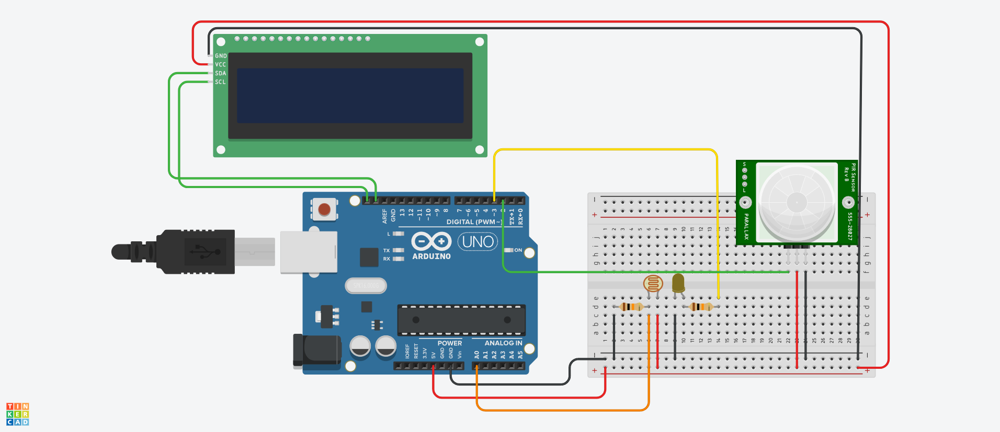
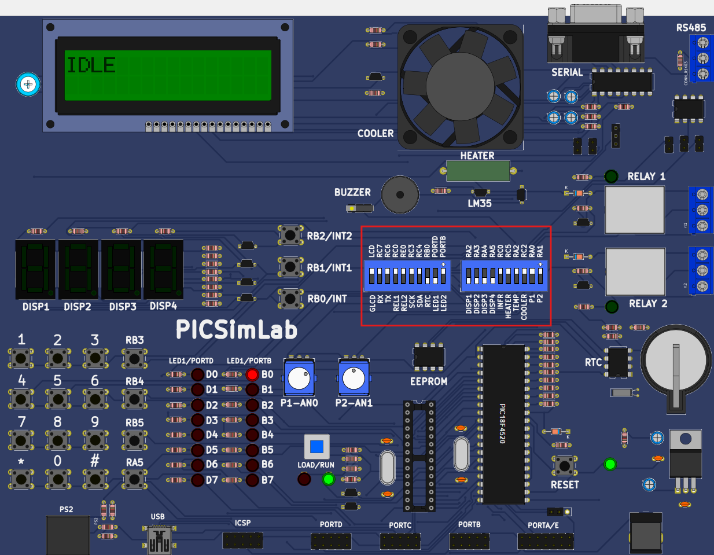
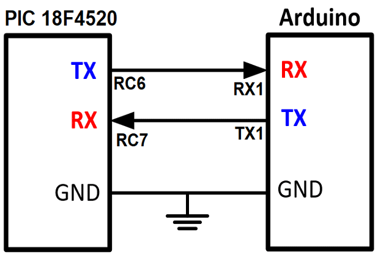

# LightMinder

Projeto de sistema embarcado desenvolvido para monitorar o uso ineficiente de iluminação em ambientes internos. A solução detecta quando há **luz acesa sem presença de pessoas** e emite alertas visuais e sonoros para estimular o desligamento da luz, promovendo economia de energia.

---

## ⚙️ Visão Geral do Funcionamento

O sistema é composto por dois microcontroladores que se comunicam via UART:

### Arduino Mega
- Utiliza um **sensor LDR** para detectar iluminação ambiente.
- Utiliza um **sensor PIR** para detectar presença humana.
- Quando detecta **luz acesa sem presença**, inicia uma contagem regressiva.
- Se após o tempo determinado a situação permanecer a mesma, envia o caractere `'A'` via UART para o PIC.
- Ao receber o sinal de retorno `'R'`, o Arduino reinicia o monitoramento.

### PIC18F4520 (Microgenios)
- Recebe o sinal `'A'` via UART.
- Ativa **alertas visuais (LED, ventoinha)** e **sonoros (Buzzer)**.
- Exibe o estado no **display LCD** e conta o tempo de alerta.
- O alerta pode ser encerrado:
  - Ao pressionar um botão físico.
  - Ou automaticamente após um tempo limite.
- Ao encerrar, envia `'R'` via UART para o Arduino.

---

## 📁 Arquivos incluídos nesta pasta

- `Arduino_master.ino`: Código-fonte que roda no Arduino Mega.
- `PIC_slave.c`: Código em C para o PIC18F4520 (kit PICGenios).

---

## 🔌 Comunicação UART

- **Baud rate:** 9600 bps
- **Protocolo simples com dois comandos:**
  - `'A'`: alerta de luz acesa sem presença.
  - `'R'`: sinal de retorno para retomar o monitoramento.

---

## 🛠️ Requisitos

- Arduino Mega 2560
- PIC18F4520 (Microgenios)
- Sensor LDR
- Sensor PIR HC-SR501
- Display LCD (comunicação I2C)
- Comunicação serial UART entre os microcontroladores

---

## 🧰 Ferramentas e Softwares Utilizados

- **Arduino IDE**: escrita do código para Arduino e uso do monitor serial.
- **MikroC PRO for PIC**: compilação do código em C para gerar o `.hex` do PIC.
- **PICKit2 Programmer**: para gravar o `.hex` no microcontrolador PIC.
- **PICSimLab**: simulação do circuito e testes do código do PIC.

---

## 📷 Imagens e Esquemas

### 🔌 Esquema de ligação do Arduino (baseado em Arduino Uno):

> 

*Obs: O esquema foi feito com Arduino Uno, mas o código foi executado no Arduino Mega.*

### 🧭 Configuração das chaves do kit PIC para os componentes usados:

> 

### 🔌 Esquema de ligação da comunicação UART:

> 

---

# English Ver. - LightMinder

Embedded systems project developed to monitor inefficient lighting usage in indoor environments. The solution detects when there is **a light on with no one present** and emits visual and sound alerts to encourage turning it off, promoting energy savings.

---

## ⚙️ System Overview

The system is built with two microcontrollers that communicate via UART:

### Arduino Mega
- Uses an **LDR sensor** to detect ambient light.
- Uses a **PIR sensor** to detect human presence.
- When **light is on with no presence**, it starts a countdown.
- If the situation remains unchanged after a certain period, it sends the `'A'` character via UART to the PIC.
- Upon receiving the `'R'` signal back, it resumes monitoring.

### PIC18F4520 (Microgenios kit)
- Receives the `'A'` signal via UART.
- Activates **visual alerts (LED, fan)** and **sound alerts (Buzzer)**.
- Displays the system status on an **LCD display** and counts the alert time.
- The alert can be stopped:
  - By pressing a physical button.
  - Or automatically after a timeout.
- Once it stops, it sends back `'R'` via UART to the Arduino.

---

## 📁 Files in this folder

- `Arduino_master.ino`: Source code for the Arduino Mega.
- `PIC_slave.c`: C code for the PIC18F4520 (Microgenios kit).

---

## 🔌 UART Communication

- **Baud rate:** 9600 bps
- **Simple protocol with two commands:**
  - `'A'`: alert – light on without presence.
  - `'R'`: resume monitoring.

---

## 🛠️ Requirements

- Arduino Mega 2560
- PIC18F4520 (Microgenios kit)
- LDR sensor
- PIR sensor (HC-SR501)
- LCD Display (I2C)
- UART communication between microcontrollers

---

## 🧰 Tools and Software Used

- **Arduino IDE**: for writing Arduino code and using the serial monitor.
- **MikroC PRO for PIC**: to compile the C code and generate the `.hex` for the PIC.
- **PICKit2 Programmer**: to upload the `.hex` file to the PIC microcontroller.
- **PICSimLab**: to simulate and test the PIC circuit.

---

## 📷 Schematics and Setup

### 🔌 Arduino Wiring Diagram (based on Arduino Uno):

> 

*Note: Diagram shows Arduino Uno, but the final system uses Arduino Mega.*

### 🧭 PIC Kit Switch Configuration for Used Components:

> 

### 🔌 UART Communication Wiring Diagram:

> 
